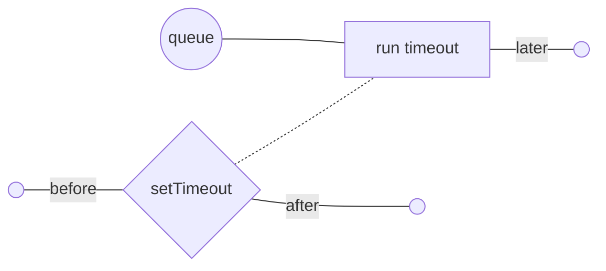
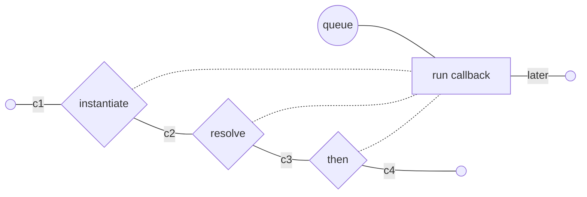
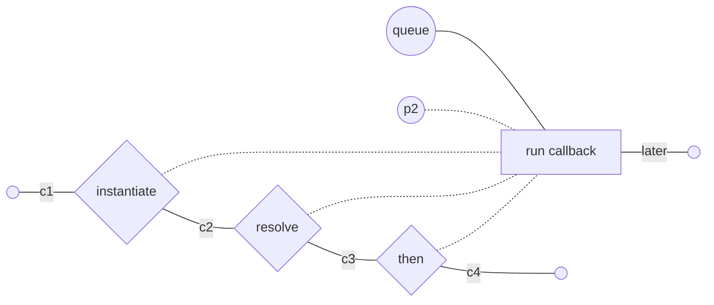
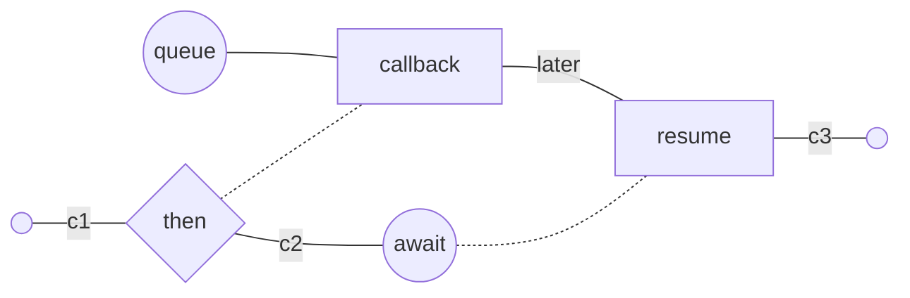

# Merge semantics

A critical detail in specifying the semantics of `AsyncContext` is determining
exactly what happens when two execution flows (with different contexts) merge.

## Branching and merging

Execution flow can be modeled as a directed acyclic graph where execution
branches and merges at various points. Concretely, branching occurs any time
a snapshot is (implicitly or explicitly) created, and merging occurs when a
snapshot is restored.

Unfortunately, without a clear model of when implicit snapshots might (or might
not) occur, it's not a useful paradigm. Instead, it's more useful to consider
the branching to occur on certain interactions with schedulers (i.e. components
that arrange for a callback to run at some later point in time). Most often,
these interactions are when a callback is submitted to be scheduled (e.g.
`setTimeout(callback, duration)`), but examples exist where snapshots could be
saved at other times (e.g. `xhr.send()`. At each of these interactions, the
scheduler has the _option_ of saving a snapshot. When the scheduler eventually
runs the scheduled callback, this constitutes a merge because the scheduler must
decide which of the saved snapshots to run the callback in (or else to run it in
the current snapshot without restoring one of the possibly-saved snapshots).
Note that when the scheduled callback is run directly from the task queue or
event loop, the realm's _initial snapshot_ is one of the snapshots participating
in the merge.

Examples of builtin schedulers include
* `Promise` (schedules callbacks passed to `then` and others; "interaction"
  points include the initial instantiation, calling the `resolve` or `reject`
  functions, as well as any instance methods, such as `then`)
* `setTimeout`, `requestAnimationFrame`, `postMessage`, etc (here the scheduling
  is generally the _only_ interaction)
* Event targets (adding listeners is the obvious scheduling interaction, but
  other interactions may exist for specific types of event targets; note that
  in many cases, the callback is run multiple times)
* DOM observers (similar to event targets, but with a slightly different shape)
* Node APIs that accept callbacks (e.g. `fs.stat`, etc)
* Async functions (interactions include the initial execution and yielding to an
  `await`, and merging occurs when resuming after an `await`)
* Generators (same as async functions, except with `yield` instead of `await`,
  and the fact that the body waits until the first call to `next()`)

We can visualize the execution flow for simple algorithms. Branch points and
merges are represented by nodes in the graph. Synchronous execution (which may
include arbitrary changes to `AsyncContext` variables) occurs along the solid
edges (this is easiest to understand with a `set` API for variables, but for
these intents, `run` can be seen equivalently by adding the correct reset
transitions). Branched snapshots are represented with dotted lines. Note that
each branch point (diamond) has a single solid outgoing edge and any number of
dotted outgoing edges that may be merged later. Merge points (rectangles) have
multiple incoming edges (exactly one solid), with a single edge that "wins" the
merge and becomes the context going forward. **The goal of this document is to
clarify which edge should win in various scenarios.**

## Examples

<!-- Note: click "View file" in the top-right three-dots menu to see the graphs
rendered in the PR. -->

The simplest example is a `setTimeout`:

```js
before;
setTimeout(() => later);
after;
```



A promise has several possible interactions:

```js
c1;
const {promise, resolve} = Promise.withResolvers();
c2;
resolve();
c3;
promise.then(() => later);
c4;
```



Note that this is potentially more complicated if the promise is resolved with
another promise `p2`, which brings its own snapshot(s) into the merge:



We can simplify this a bit by considering `p2` to be the immediate (solid line)
cause, in place of the event queue.

Now consider an async function:

```js
c1;
const p = Promise.resolve().then(() => later);
c2;
await p;
c3;
```



## Considerations

It's clear from the above examples that there are numerous different types of
merges, and each type accepts a different set of incoming edges. In addition to
the different types of flow, there may also be any number of different variables
involved. At every different merge point and for every different variable, we
must decide a winner among the incoming edges. If there are `M` different merge
types and `N` different variables, this makes `N*M` decisions to make. For
example, a variable pertaining to performance monitoring might want to follow
the execution flow as closely as possible, while a variable pertaining to
cancellation or dependency injection might prefer to follow the source graph and
behave more like an implicit function parameter.  That said, **it's not clear
that the decision separates cleanly into a function of just one parameter**
(either the variable or the merge type). For example, cancellation may need to
follow the execution flow (rather than the source graph, as suggested above) in
an uncaught rejection handler in order to abort the remainder of a job when one
part of it fails, while dependency injection would need the other.

Another way to look at this dilemma is in light of the different types of span
references defined by OpenTracing: ChildOf and FollowsFrom. The former indicates
that the parent is depending on one or more children to complete in order for
itself to complete, while the latter indicates a causal relationship but not a
dependency. In some cases, the correct edge choice for context propagation
splits between execution flow or source graph, while in other cases it's split
between ChildOf and FollowsFrom. Moreover, the mapping between the two is not
one-to-one. Consider the old style of Node.JS callback APIs: there is no way to
know when one function calls another whether it's a depended-on ChildOf or
simply a passed-in FollowsFrom continuation.

We've seen several different axes along which to split the incoming merge edges.
Some of these axes map more closely to useful or important concepts that users
may want to split on, while others more closely map to existing syntax and
semantics in the language and builtin APIs. Additionally, the clarity and
consistency of this semantic mapping varies as well.

Another consideration is expressibility. Given that no single choice of default
propagation can satisfy all use cases, it's important that we have some path to
access the non-default alternatives (either up front, or else with a reasonable
path via a future proposal). For any given choice, we must also consider the
cost of an incorrect default: assuming it _is_ possible to access the
alternatives, will ordinary developers be well-informed enough to know _when_ to
do so. Given that user code generally needs to be ignorant of the set of
variables, the worst case is that developers simply mindlessly copy a workaround
to change the default at every merge point, in "cargo cult" style. In this case,
we end up with an even worse situation because it's impossible to know whether
to trust any given signal. Perhaps an ideal situation would be for developers to
somehow signal the semantics of a merge and let the system handle it from there
(though this is still likely infeasible). The best compromise is likely to go
with a very straightforward rule that can apply universally to all merge types,
and to provide a workaround that doesn't lend itself to cargo-cult abuse.

## Survey of merge types

This is a non-exhaustive list of some merge types and the different types of
incoming edges related to them.

* `await`


---

heterogeneous vs generalized
unwrapping multiple wraps
